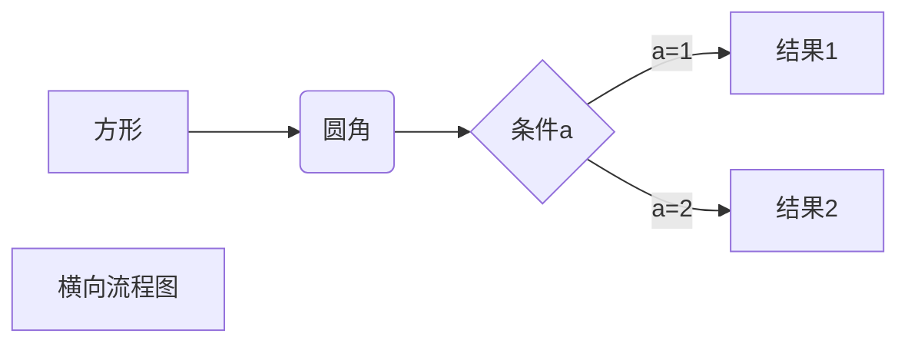

[TOC]

# 标题一
## 标题二
### 标题三

==高亮==

``` C#
for (int i = 0; i < longs.Length; i++)
            {

            }
            sw.Stop();
            Console.WriteLine(sw.Elapsed);

```


* 序列
 * 序列1

 